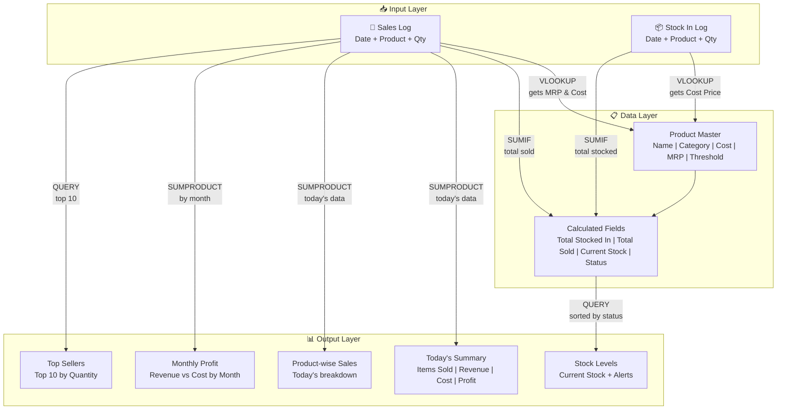

# Shop-Stocker: System Architecture

Technical architecture document for the Shop-Stocker Google Sheets inventory management system.

---

## System Overview

Shop-Stocker is a **single Google Sheets workbook** that replaces manual notebook tracking for an Amul dairy outlet. It uses a layered architecture where **data entry sheets** feed into a **master sheet**, which drives an **auto-calculating dashboard**.

```
┌─────────────────────────────────────────────────────────────────┐
│                    SHOP-STOCKER WORKBOOK                        │
│                                                                 │
│  ┌─────────────┐     ┌─────────────┐     ┌──────────────────┐  │
│  │  INPUT       │     │  DATA       │     │  OUTPUT          │  │
│  │  LAYER       │     │  LAYER      │     │  LAYER           │  │
│  │             │     │             │     │                  │  │
│  │ 🛒 Sales    │────►│ 📋 Product  │────►│ 📊 Dashboard     │  │
│  │    Log      │     │    Master   │     │                  │  │
│  │             │     │             │     │ • Today Summary  │  │
│  │ 📦 Stock In │────►│  (Central   │────►│ • Stock Levels   │  │
│  │    Log      │     │   Hub)      │     │ • Profit Reports │  │
│  │             │     │             │     │ • Top Sellers    │  │
│  └─────────────┘     └─────────────┘     └──────────────────┘  │
│                                                                 │
│       ENTRY              PROCESSING           REPORTING         │
│    (Helpers OK)        (Owner Only)          (View Only)        │
└─────────────────────────────────────────────────────────────────┘
```

---

## Architecture Layers

### Layer 1: Input Layer (Data Entry)

The entry point for all data. Designed for speed and simplicity on a mobile phone.

| Sheet | Purpose | Who Uses |
|-------|---------|----------|
| **बिक्री (Sales Log)** | Records every sale transaction | Owner + Helpers |
| **माल आवक (Stock In Log)** | Records every restock from distributor | Owner + Helpers |

**Design Principles:**
- Minimal manual input — only 3 fields: Date, Product (dropdown), Quantity
- All other columns auto-calculate via formulas
- Formula columns are protected from helper edits
- Dropdown validation prevents typos in product names

### Layer 2: Data Layer (Product Master)

The central hub that connects inputs to outputs. Stores static product data and computes live stock levels.

| Sheet | Purpose | Who Uses |
|-------|---------|----------|
| **उत्पाद सूची (Product Master)** | Product catalog + live stock calculations | Owner only |

**Design Principles:**
- Single source of truth for all product information
- `SUMIF` formulas pull from Sales Log and Stock In Log to compute live stock
- Status column provides instant visual feedback (✅ / ⚠️ / ❌)

### Layer 3: Output Layer (Dashboard)

Read-only reporting layer that aggregates data from all other sheets.

| Sheet | Purpose | Who Uses |
|-------|---------|----------|
| **डैशबोर्ड (Dashboard)** | Visual summary of all key metrics | Everyone (view only) |

**Design Principles:**
- Zero manual input required — everything auto-calculates
- Organized into logical sections for quick scanning
- Designed to be readable on both phone and laptop

---

## Data Flow Diagram



---

## Formula Architecture

### Lookup Pattern (Sales Log & Stock In → Product Master)

All pricing data flows **from Product Master to entry sheets** via `VLOOKUP`:

```
Sales Log                              Product Master
─────────                              ──────────────
Product: "Amul Taaza 500ml"  ──VLOOKUP──►  MRP: ₹27
                              ──VLOOKUP──►  Cost: ₹22
```

```
=VLOOKUP(B2, 'उत्पाद सूची'!A:D, 4, FALSE)    ← Gets MRP
=VLOOKUP(B2, 'उत्पाद सूची'!A:C, 3, FALSE)    ← Gets Cost Price
```

### Aggregation Pattern (Entry Sheets → Product Master)

Stock levels are computed **in Product Master** by aggregating from entry sheets via `SUMIF`:

```
Stock In Log          Product Master          Sales Log
────────────          ──────────────          ─────────
+50 Taaza  ──SUMIF──► Total In: 50
                      Total Sold: 12  ◄──SUMIF── -12 Taaza
                      Current: 38
                      Status: ✅ OK
```

```
=SUMIF('माल आवक'!B:B, A2, 'माल आवक'!C:C)     ← Total Stocked In
=SUMIF('बिक्री'!B:B, A2, 'बिक्री'!C:C)         ← Total Sold
=G2 - H2                                        ← Current Stock
```

### Dashboard Pattern (All Sheets → Dashboard)

Dashboard uses `SUMPRODUCT` for date-filtered aggregations and `QUERY` for sorted/grouped views:

```
=SUMPRODUCT(('बिक्री'!A:A=TODAY()) * ('बिक्री'!C:C))        ← Items sold today
=SUMPRODUCT(('बिक्री'!A:A=TODAY()) * ('बिक्री'!E:E))        ← Revenue today

=QUERY('उत्पाद सूची'!A:J, "SELECT A,B,I,J ORDER BY J ASC")  ← Stock sorted by status
=QUERY('बिक्री'!B:C, "SELECT B, SUM(C) GROUP BY B           ← Top sellers
        ORDER BY SUM(C) DESC LIMIT 10")
```

---

## Access Control Architecture

```
┌──────────────────────────────────────────────────────┐
│                  ACCESS MATRIX                       │
├──────────────┬───────────────┬────────────────────────┤
│    Sheet     │    Owner      │    Helpers             │
├──────────────┼───────────────┼────────────────────────┤
│ Product      │ ✏️ Full Edit  │ 👁️ View Only           │
│ Master       │               │                        │
├──────────────┼───────────────┼────────────────────────┤
│ Sales Log    │ ✏️ Full Edit  │ ✏️ Columns A,B,C only  │
│              │               │ 🔒 D-H locked          │
├──────────────┼───────────────┼────────────────────────┤
│ Stock In Log │ ✏️ Full Edit  │ ✏️ Columns A,B,C only  │
│              │               │ 🔒 D-E locked          │
├──────────────┼───────────────┼────────────────────────┤
│ Dashboard    │ ✏️ Full Edit  │ 👁️ View Only           │
└──────────────┴───────────────┴────────────────────────┘
```

**Implementation:**
- Use Google Sheets' **Protect sheets and ranges** feature
- Product Master & Dashboard: "Only me" can edit
- Sales & Stock In Logs: Protect formula columns (D onwards), allow helpers to edit A, B, C

---

## Data Validation Architecture

```
┌────────────────────────────────────────────────────────────┐
│                VALIDATION RULES                            │
├─────────────┬──────────┬───────────────────────────────────┤
│   Sheet     │ Column   │ Rule                              │
├─────────────┼──────────┼───────────────────────────────────┤
│ Sales Log   │ A (Date) │ Valid date, ≤ TODAY()             │
│             │ B (Name) │ Dropdown: 'उत्पाद सूची'!A2:A     │
│             │ C (Qty)  │ Integer ≥ 1                       │
├─────────────┼──────────┼───────────────────────────────────┤
│ Stock In    │ A (Date) │ Valid date, ≤ TODAY()             │
│             │ B (Name) │ Dropdown: 'उत्पाद सूची'!A2:A     │
│             │ C (Qty)  │ Integer ≥ 1                       │
└─────────────┴──────────┴───────────────────────────────────┘
```

**Dropdown source** is a named range pointing to Product Master Column A, ensuring:
- No typos in product names
- Consistent data across all sheets
- Easy addition of new products (just add to Product Master)

---

## Offline Architecture

```
┌─────────────────────────────────────────────────┐
│           OFFLINE CAPABILITY                    │
│                                                 │
│  Google Sheets App (Android)                    │
│  ┌───────────────────────────────────────────┐  │
│  │  📱 Phone (Offline Mode Enabled)          │  │
│  │                                           │  │
│  │  1. Open Google Sheets app                │  │
│  │  2. ⋮ Menu → "Make available offline"     │  │
│  │  3. Sheet cached locally on device        │  │
│  │  4. All entries saved locally             │  │
│  │  5. Auto-syncs when internet available    │  │
│  └───────────────────────────────────────────┘  │
│                                                 │
│  Requirements:                                  │
│  • One-time internet to download the sheet      │
│  • Google Sheets app installed                  │
│  • "Offline" toggle enabled in app settings     │
│                                                 │
│  Limitations:                                   │
│  • QUERY() formulas may not update offline      │
│  • Dashboard may show stale data until sync     │
│  • Dropdowns work offline ✅                    │
│  • VLOOKUP/SUMIF work offline ✅                │
└─────────────────────────────────────────────────┘
```

---

## User Interaction Flow

### Sale Entry Flow (5 seconds)

```
┌─────────┐    ┌──────────────┐    ┌───────────┐    ┌──────────┐
│ Open     │    │ Tap Product  │    │ Type      │    │ Done ✅  │
│ Sales    │───►│ Dropdown     │───►│ Quantity   │───►│ Move to  │
│ Log Tab  │    │ "Amul Taaza" │    │ "5"       │    │ next row │
└─────────┘    └──────────────┘    └───────────┘    └──────────┘
     │                                                    │
     │         Auto-fills: Date, MRP, Total,              │
     │         Cost, Profit                               │
     └────────────────────────────────────────────────────┘
```

### Stock Entry Flow (5 seconds)

```
┌─────────┐    ┌──────────────┐    ┌───────────┐    ┌──────────┐
│ Open     │    │ Tap Product  │    │ Type      │    │ Done ✅  │
│ Stock In │───►│ Dropdown     │───►│ Quantity   │───►│ Stock    │
│ Log Tab  │    │ "Amul Taaza" │    │ "50"      │    │ updated  │
└─────────┘    └──────────────┘    └───────────┘    └──────────┘
     │                                                    │
     │         Auto-fills: Date, Cost Price,              │
     │         Total Cost                                 │
     └────────────────────────────────────────────────────┘
```

### Dashboard View Flow

```
┌─────────┐    ┌──────────────────────────────────────────┐
│ Open     │    │ 📊 All data auto-calculated              │
│ Dashboard│───►│                                          │
│ Tab      │    │  Today: 47 items | ₹2,340 | Profit ₹470 │
│          │    │  ⚠️ Low: Paneer (3), Chocobar (4)        │
│          │    │  📈 Top: Taaza, Gold, Butter              │
│          │    │  📅 Sep Profit: ₹9,700                    │
└─────────┘    └──────────────────────────────────────────┘
```

---

## Scalability Considerations

| Aspect | Current Design | Future Enhancement |
|--------|---------------|-------------------|
| Products | 50+ static list | Categorized sub-sheets if 200+ |
| Sales volume | ~50–100 entries/day | Archive old months to separate tabs |
| Users | 1 owner + 2 helpers | Role-based access with Google Workspace |
| Reporting | Daily + Monthly | Weekly trends, year-over-year comparison |
| Credit tracking | Not included | Add "उधार (Credit)" sheet in Phase 2 |
| Expiry tracking | Not included | Add batch-level tracking in Phase 2 |
| Multi-store | Single store | Separate workbooks per store, consolidated master |

---

## Technology Stack

| Component | Technology |
|-----------|-----------|
| Platform | Google Sheets (Google Workspace) |
| Formulas | VLOOKUP, SUMIF, SUMPRODUCT, QUERY, IF, TODAY |
| Data Validation | Dropdown lists, number constraints |
| Formatting | Conditional formatting, frozen headers, protected ranges |
| Offline | Google Sheets Android app offline mode |
| Access Control | Google Sheets sharing + sheet/range protection |
| Device Support | Android phone (Google Sheets app) + Laptop (Chrome browser) |
